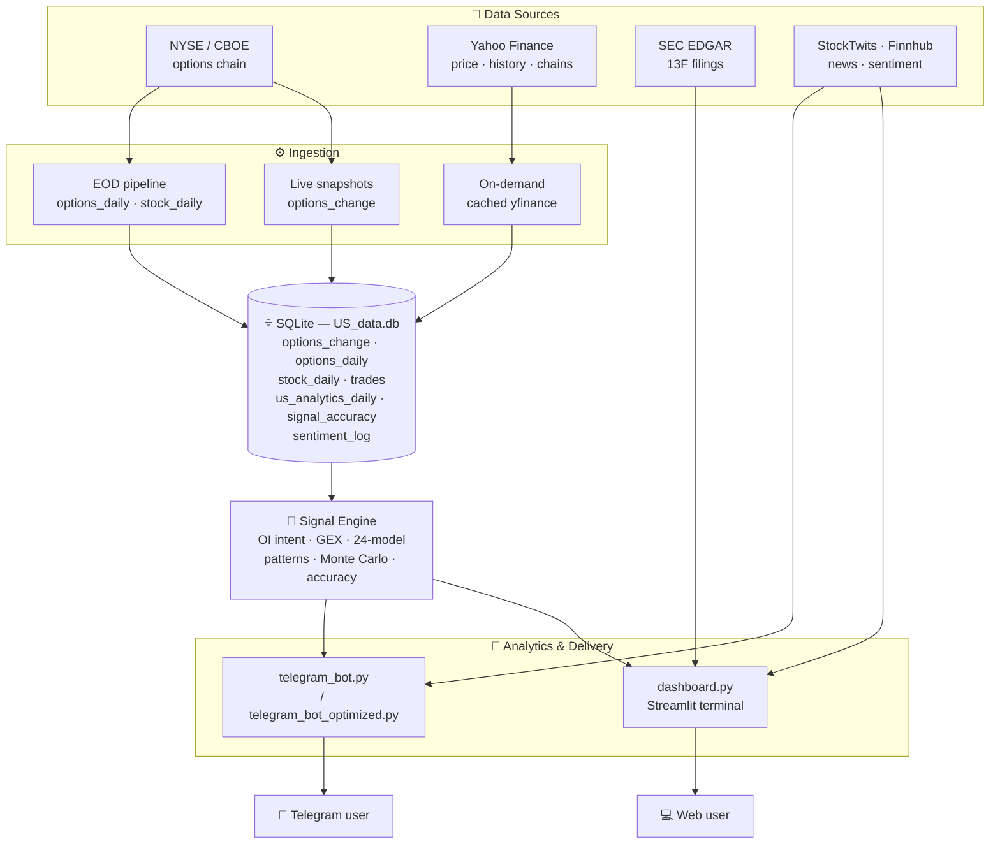
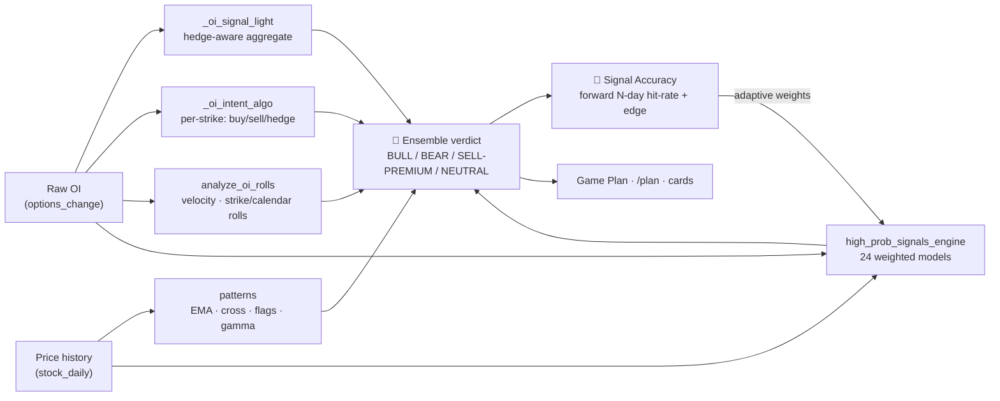
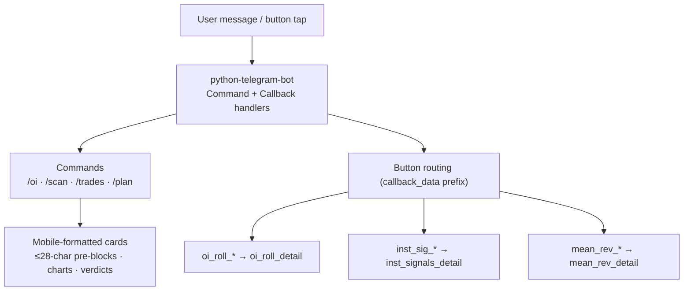

# 📊 NYSE_DATA — Options Intelligence Terminal

> An end-to-end **US options analytics platform** that turns raw NYSE/CBOE options-chain data into actionable, *explained* trade intelligence — delivered through both a **Streamlit web terminal** and a **Telegram bot**.

Built on Open Interest flow, dealer gamma positioning, a 24-model signal ensemble, options-pricing math (Black–Scholes + Monte Carlo), and a forward-tested **signal-accuracy** layer that keeps every signal honest.

---

## ✨ What it does

| Pillar | What you get |
|---|---|
| **OI Flow Analytics** | Buying vs selling vs hedging per strike, ΔOI across strikes *and* across expiries (calendar), gamma walls, max pain, PCR |
| **24-Model Ensemble** | A high-probability signal engine combining GEX, PCR-Z, IV skew, volume profile (VRVP), term structure, smart-money UOA, momentum and more — each model weighted by its *recent* accuracy |
| **Next-Day Game Plan** | Per-position scenario analysis: portfolio Greeks, VaR/CVaR, Monte-Carlo P&L distribution, hold-vs-close debate, execution timing, after-hours-aware pricing |
| **Technical Patterns** | EMA sequence (8/21/50), golden/death cross, bull/bear-flag continuation, dealer gamma regime ("golden gamma" flip) |
| **Signal Accuracy Lab** | Every signal backtested against the forward N-day move — hit-rate, directional edge, and walk-forward — so you know what actually works |
| **Smart Money** | SEC EDGAR 13F history pipeline, legendary-investor tracker, insider / congress / dark-pool signals |
| **Global / Macro** | Cross-market regions, future-growth themes, macro backdrop, institutional research & white-paper feeds |
| **Sentiment** | News tone + StockTwits/Finnhub crowd, forward-logged and scored alongside the hard signals |

---

## 🏗 System architecture



---

## 🔁 Signal pipeline



The **adaptive-weight loop** is the core idea: each model's recent forward accuracy (stored in `signal_accuracy`) feeds back as a weight, so models that have been right lately count for more.

---

## 🖥 The Streamlit terminal

Organized into navigable sections (dark fintech theme by default, light minimal toggle):

- **📈 Markets & OI** — Market Overview, OI Comparison Charts, OI Analytics & Prediction
- **💡 Trade Ideas** — Prop Trading Screen, 24-Model High-Prob Engine, Gamma Wall Advisor, Live Momentum Scanner
- **💼 Portfolio & Risk** — Portfolio & Suggestions, Live Position Predictor, Trade Risk Calculator, **Next-Day Exit Planner / Game Plan**, Backtest Lab, **🎯 Signal Accuracy**
- **🏛 Smart Money & News** — Insider / Congress / Whales, Legendary Investors (13F), Smart Money Hub, News & Calendar
- **🌍 Global / Macro** — Global Opportunities, Macro/Event Hub

---

## 📱 The Telegram bot



`telegram_bot_optimized.py` is the production build — a deduped union of the bot logic with raised cache TTLs and streamlined yfinance routing for speed.

---

## 🗄 Database schema (key tables)

| Table | Key columns | Update frequency |
|---|---|---|
| `options_change` | ticker, strike, expiry_date, trade_date_now, change_OI_Call/Put, openInt_*_now/prev, pct_change_OI_*, R1, S1 | Intraday / EOD |
| `options_daily` | raw daily chain snapshot (same shape) | EOD |
| `stock_daily` | ticker, trade_date, close, pcr_oi | EOD |
| `trades` | trade_id, ticker, strategy, entry_date, expiry, status, strike, option_type, pnl | Manual / auto-close |
| `us_analytics_daily` | call/put_notional_oi, bull_score, bear_score, avg_spot | Daily |
| `signal_accuracy` | ticker, trade_date, model_name, signal, prob, actual_ret, correct | Live (self-tracking) |
| `sentiment_log` | ticker, trade_date, source, label, score, fwd_ret | Forward-logged |

> **Date convention:** dates are stored as `MM-DD-YYYY` strings — sort with
> `substr(date,7,4)||substr(date,1,2)||substr(date,4,2)`.

---

## 🧰 Tech stack

- **Python** · pandas · numpy · scipy
- **Streamlit** (web terminal) · **python-telegram-bot** (bot)
- **Plotly** (charts) · **SQLite** (storage)
- **yfinance** (prices/chains) · **SEC EDGAR** (13F) · **StockTwits / Finnhub** (sentiment)
- Quant: Black–Scholes greeks & pricing, implied-vol solver, GBM Monte Carlo, historical VaR/CVaR

---

## 🚀 Getting started

```bash
# 1) Install dependencies
pip install streamlit python-telegram-bot pandas numpy scipy plotly yfinance

# 2) Launch the web terminal
streamlit run dashboard.py

# 3) Run the Telegram bot (set TELEGRAM_TOKEN first)
python telegram_bot_optimized.py
```

The dashboard reads from `US_data.db`; the EOD/live ingestion scripts populate it from the options-chain and yfinance feeds.

---

## 📁 Project structure

```
NYSE_DATA/
├── dashboard.py                 # Streamlit terminal (all pages + signal engine helpers)
├── telegram_bot.py              # Full Telegram bot
├── telegram_bot_optimized.py    # Production bot (deduped + cached)
├── run_eod_pipeline.py          # End-of-day ingestion
├── run_all_offhours.py          # Off-hours batch jobs
├── architecture.md              # Detailed component flowcharts
├── CLAUDE.md                    # Engineering reference (schema, functions, patterns)
└── README.md                    # You are here
```

See **[architecture.md](architecture.md)** for component-level flowcharts (OI pipeline, EOD vs live views, async performance pattern, message-size handling).

---

## ⚠️ Disclaimer

This project is for **educational and research purposes only**. All signals, scenarios, and scores are derived from historical data plus Black–Scholes modeling and are **not financial advice**. Options trading carries substantial risk. Real fills, IV shifts, and gaps will differ from any model output. Do your own research.
